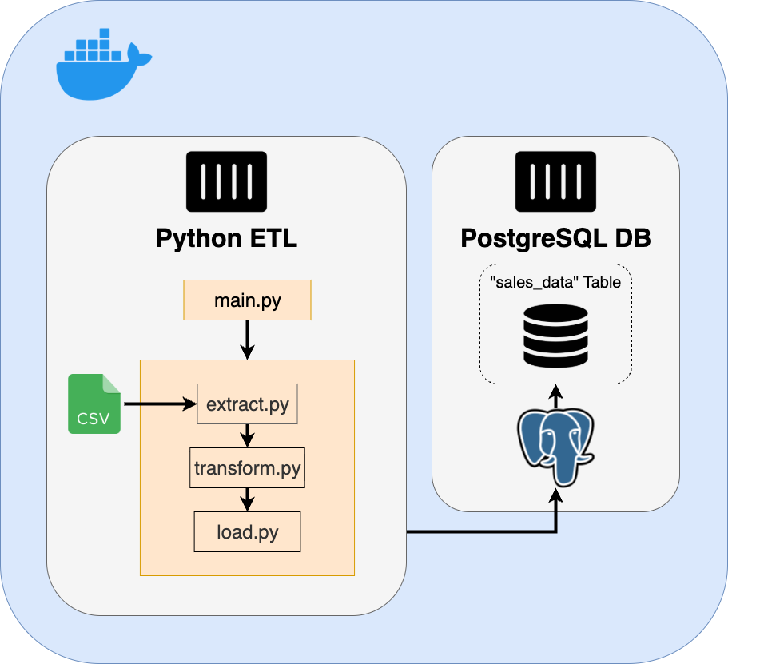

# CSV‑to‑SQL ETL Pipeline
<p align="center">

</p>

## 🧩 Project Overview

A fully containerized ETL pipeline that extracts data from a retail sales CSV file, transforms it using Python and Pandas, and loads it into a PostgreSQL database. The project is designed to demonstrate clean architecture, Docker integration, and modular ETL logic.

## 🚀 Features

- **Containerized with Docker Compose**: Spin up both the ETL process and PostgreSQL with one command.
- **Modular ETL Scripts**: Split into `extract.py`, `transform.py`, and `load.py` for maintainability.
- **Single-entry ETL pipeline**: Run everything through a clean `run_pipeline()` function in `main.py`.
- **Python with Pandas**: Efficient data manipulation using industry-standard tools.
- **Isolated Environment**: Dependencies managed with Pipenv inside the container.

## 🧾 Dataset Overview

The pipeline works with a sample dataset: `retail_store_sales.csv`, which contains simulated retail transaction data. It includes the following columns:

| Column Name        | Data Type | Description                             |
|--------------------|-----------|-----------------------------------------|
| Transaction ID     | string    | Unique identifier for the transaction   |
| Customer ID        | string    | Unique identifier for the customer      |
| Category           | string    | Product category                        |
| Item               | string    | Name of the product                     |
| Price Per Unit     | float     | Price of a single unit                  |
| Quantity           | float     | Number of units purchased               |
| Total Spent        | float     | Total amount spent                      |
| Payment Method     | string    | Payment method used (e.g., cash, card)  |
| Location           | string    | Store location                          |
| Discount Applied   | boolean   | Whether a discount was applied          |

## 🐳 Running the Project (Docker)

### 📦 Prerequisites

- Docker & Docker Compose installed

### ▶️ Run the ETL Pipeline

```bash
docker compose up --build